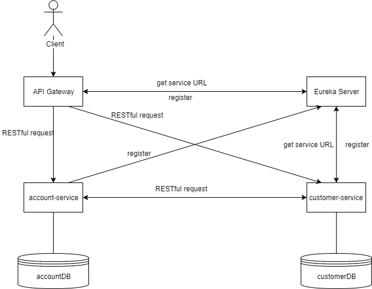

# spring-boot-microservices
Example of microservies architecture

## Used technologies

* Spring Boot 1.5.9 RELEASE
* Eureka
* Zuul
* Ribbon
* Feign
* Lombok
* h2

## Introduction

This is simple example of microservices architecture.
Client calls some endpoint via API Gateway which interacts with running
services to collect data from those services.
Then data is returned to client.
All that client has to know is gateway endpoints.
The picture below shows structure of this project.



## How it works

To show how it's done we've created two services:
* account-service
* customer-service

Each of those services has own data model and database (for the purpose of this example
we'll be using in-memory h2 database), jpa repository and rest controller.

Next we've created gateway-service which is nothing more than simple spring boot application
with enabled Zuul proxy. This is going to be our API Gateway. We're using it to expose only one IP address to the
outside world, when rest of services are hidden. Here is proxy configuration to ensure
correct request forwarding (gateway-service.yml):

```
zuul:
  prefix: /api
  routes:
    account:
      path: /account/**
      serviceId: account-service
    customer:
      path: /customer/**
      serviceId: customer-service
```

Now when we call endpoint {hostname}:{port}/api/account/{some-uri} request will be forwarded to
service with id "account-service" and method with {some-uri} request mapping will be called.
In order to recognize what is behind those service id's we had to use Eureka Server in discovery-service.
Eureka Server register all running instances of applications which are annotated with EnableEurekaClient
annotation. Here is Eureka server configuration (discovery-service.yml):
```
server:
  port: ${PORT:8761}

eureka:
  instance:
    hostname: localhost
  client:
    registerWithEureka: false
    fetchRegistry: false
  server:
    enableSelfPreservation: false
```

To register application in Eureka we have to configure our applications. Here is an example of account-service
configuration (account-service.yml):
```
server:
  port: ${PORT:2222}

spring:
  application:
    name: account-service

eureka:
  client:
    serviceUrl:
      defaultZone: ${EUREKA_URI:http://localhost:8761}/eureka/
  instance:
    leaseRenewalIntervalInSeconds: 1 # for testing only
    leaseExpirationDurationInSeconds: 1 # for testing only
```

After running application with this kind of configuration, app is going to be registered in Eureka
Server.

Now we have two microservices, API gateway and discovery service. Next step is to provide connection
between account-service and customer-service. In this case we've used simple interface with annotation
FeignClient and tell our application to use feign clients by adding @EnableFeignClients to CustomerServiceApplication.java.
FeignClient is a declarative web service client to simplify writing web service clients.
This is how it looks in AccountClient inside customer-service

```java
@FeignClient("account-service")
public interface AccountClient {

    @GetMapping("/account/customer/{customerId}")
    List<AccountDTO> getAccountsForCustomer(@PathVariable("customerId") Long id);
```

Now when we call getAccountsForCustomer method, it will simply fetch data from account-service using request mapping from @GetMapping. The implementation
of this method is created by Spring on-fly so we doesn't need to implement it by ourselves.

The last step is load balancing. Microservices architecture is based on having multiple instances of same application to ensure that service
is available anywhere anytime. When we call some endpoint via API Gateway, request should be forwarded to specific microservice, but when
we have multiple instances, something has to decide, where request should go. This is job for load balancer. In this example we're using Ribbon - client
side load balancer. Here is simple configuration form YAML file

```
ribbon:
  eureka:
    enabled: true
```

After configuring load balancig our project is ready to go. It's worth to mention that it's only example, so we doesn't change default implementations
of load balancer, feign clients etc.

## Starting apps

In order to run our example we have to build executable jars by using maven command (for Windows)
```bash
mvnw.cmd clean install
```
or we can use batch file mvn-clean-install.cmd which build jars simultaneously, each in new command prompt.

After that, we can run our apps by using command
```bash
java -jar target/{generated-jar-name}.jar
```

First we should run discovery-service, then rest of services. In order to run multiple instances of same service, we should use command
```bash
java -Dserver.port={port-number} -jar target/{generated-jar-name}.jar
```

When all of applications are running, we can use any browser to check Eureka dashboard, which is located under http://localhost:8761 and check
if our applications are already registered in Eureka by going to http://localhost:8761/eureka/apps. It is worth to mention that Eureka and Ribbon
require some time to recognize applications, so calling API gateway method right after launch will produce forwarding error.

## Testing connection between microservices and load balancing

To test if everything works fine, we have just send GET request to http://localhost:8765/api/customer/customer/{customerId}. The expected
result is JSON with customer data and his list of accounts.

```
{
   "id":1,
   "firstName":"pawel",
   "lastName":"troc",
   "accountsList":[
      {
         "id":1,
         "password":"xyz"
      },
      {
         "id":2,
         "password":"abc"
      }
   ]
}
```

If we are running multiple instances of each service, we can see in console logs that requests are shared between instances by load balancer.